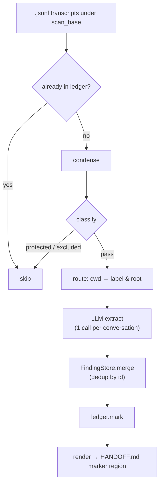

[日本語](README.md) | **English**


# claude-transcript-organizer

> A CLI that distils Claude Code transcripts into per-project `HANDOFF.md` — the LLM only proposes, deterministic code does every write, so a flaky LLM never corrupts your HANDOFF.
> Claude Code の会話 transcript を解析し、プロジェクトごとの `HANDOFF.md` に知見を蓄積する CLI ツール。LLM は提案するだけで、書き込みは決定論的コードが担う。
>
> **Version 1.1.0**

It scans the conversation files (`.jsonl`) accumulated under `~/.claude/projects`, sends them to an **LLM** to extract technical findings, decisions and TODOs, and writes them into a dedicated marker region of each project's `HANDOFF.md`. Everything a human wrote outside that region is left untouched.



> Docs: operations manual in [docs/USAGE.md](docs/USAGE.md), design & architecture in [docs/DESIGN.md](docs/DESIGN.md).

---

## Core flow: organize → status → delete

### 1. organize

```bash
python cli.py organize
```

Scans conversations, extracts findings with the LLM, and updates `HANDOFF.md`. To preview without writing anything:

```bash
python cli.py organize --dry-run
```

To watch the per-conversation trace (which transcript is read, how it is classified/routed, what findings are extracted), use `--verbose` (`-v`). The trace goes to **stderr**, the final summary to **stdout**. Each line is English in the form `HH:MM:SS · event · id · detail` (event = `read` / `route` / `extract` / `skip` / `dry-run` / `handoff`). On a TTY a progress bar with a remaining count is pinned to the bottom line (`#` hashes).

```bash
python cli.py organize --verbose
```

Example output (stderr):

```
02:29:47 · read    · 04520aae-5f96-48f5-99a8-a112de5b2042 · title='Review feature design' cwd=… msgs=23 chars=7119
02:29:47 · route   · 04520aae-5f96-48f5-99a8-a112de5b2042 · label=my-project root=<PROJECTS>/my-project
02:29:52 · extract · 04520aae-5f96-48f5-99a8-a112de5b2042 · proposed=7 {'decision': 3, 'next_step': 2, 'gotcha': 2} new=4
02:30:01 · skip    · 0c059f90-dc2f-4ab3-84d3-5b5f24a059ce · trivial (too little content)
02:35:10 · handoff · my-project · <PROJECTS>/my-project/docs/HANDOFF.md
[##############----------]  58.3%  712/1220  remaining 508
```

Restrict to a single project:

```bash
python cli.py organize --project my-project
```

Reprocess conversations already in the ledger (to rebuild a lost HANDOFF):

```bash
python cli.py organize --rebuild
```

When organizing finishes, it asks whether to delete (move to trash) next. Answer `y` to run the equivalent of `delete --yes`; anything else deletes nothing. Pass `--yes` (`-y`) to skip the prompt and trash automatically. With `--dry-run` it never asks.

```bash
python cli.py organize -y        # organize, then delete in one go
```

### 2. status

```bash
python cli.py status
```

Shows the unprocessed count, ledger size, and per-project findings counts.

### 3. delete

```bash
# dry-run: just lists deletion candidates (default)
python cli.py delete

# actually move them to trash
python cli.py delete --yes

# restrict to a single project
python cli.py delete --project my-project --yes
```

A conversation moved to trash is dropped from the ledger at the same time, so orphaned entries don't pile up and the `status` ledger count stays accurate.

---

## Installation

If you have Python 3.9+, it runs. Standard library only — no extra packages. Clone the repo anywhere and run the commands from the directory that holds `cli.py`.

```bash
git clone <repo> claude-transcript-organizer
cd claude-transcript-organizer
python cli.py status        # smoke test (read-only)
```

To call `tsorg`/`tstat`/`tsdel` from any directory, put `bin/` on PATH. For the per-OS execution model and local-LLM setups, see [Shortcut commands](#shortcut-commands-tsorg--tstat--tsdel).

### Windows

Running the bundled `install.ps1` once adds `bin/` to your user PATH. It is idempotent, so re-running never duplicates the entry.

```powershell
.\install.ps1
```

It also updates the running session's PATH, so `tsorg` works right away, and stays available in new shells. If script execution is blocked by policy, start it as `powershell -ExecutionPolicy Bypass -File install.ps1`. Remove the entry with `-Uninstall`:

```powershell
.\install.ps1 -Uninstall
```

To add it manually instead (PowerShell):

```powershell
$bin = "<this-repo>\bin"
$cur = [Environment]::GetEnvironmentVariable("Path", "User")
if (($cur -split ';') -notcontains $bin) {
  [Environment]::SetEnvironmentVariable("Path", $cur.TrimEnd(';') + ';' + $bin, "User")
}
```

Each `.cmd` resolves the repo location via `%~dp0`, so moving the repo only requires re-adding `bin` to PATH. To avoid mojibake on Japanese output the wrappers set `chcp 65001` (restored on exit), plus `PYTHONUTF8=1` for the Windows-side run.

### macOS / Linux

`install.sh` makes the posix wrappers executable and symlinks them into `~/.local/bin`. It is idempotent.

```bash
sh install.sh
```

Change the destination with `TSORG_BIN_DIR=/usr/local/bin sh install.sh`. If the destination is not on PATH, the script says so. Remove the links with `sh install.sh --uninstall`. You can also put `bin/` on PATH directly:

```bash
export PATH="$PATH:/path/to/repo/bin"   # add to your shell rc
```

Each wrapper resolves the repo location on its own, so moving the repo only requires re-linking.

---

## Provider selection

Switch backend with the `--provider` flag or the `provider` key in `config.json`.

```bash
python cli.py organize --provider gemini      # default
python cli.py organize --provider anthropic
python cli.py organize --provider openai
python cli.py organize --provider ollama      # local; no API key
```

Environment variables each provider needs:

| provider | env var |
|----------|---------|
| `gemini` | `GEMINI_API_KEY` |
| `anthropic` | `ANTHROPIC_API_KEY` |
| `openai` | `OPENAI_API_KEY` |
| `ollama` | none (set the endpoint via `endpoint` in `config.json`) |

---

## Shortcut commands (tsorg / tstat / tsdel)

`bin/` ships wrappers so the commands are callable from any directory: `.cmd` for Windows and extensionless shell scripts (`tsorg`/`tstat`/`tsdel`) for macOS/Linux. They share names, so once `bin/` is on PATH the same command name works on every OS.

| command | equivalent |
|---------|------------|
| `tsorg` | `python cli.py organize …` |
| `tstat` | `python cli.py status` |
| `tsdel` | `python cli.py delete` |

`tsorg` adds `--verbose` by default. The Windows `.cmd` version switches execution target based on which config file exists next to the repo (adaptive):

- **If `config.wsl.json` exists → run inside WSL** (`wsl python3 cli.py …`). For driving a local LLM via ollama in WSL. Windows⇄WSL HTTP POST is unreliable for sustained calls, so the tool itself runs inside WSL and reaches ollama over **native localhost**.
- **Otherwise → run with Windows python**, reading `config.local.json` (if present).

The posix version has no such branch: it always runs `python3`, reading `config.local.json` if present, otherwise `config.json`.

Both config files are gitignored and optional. The Windows `tstat`/`tsdel` use no LLM, so they always run on the Windows side. Arguments are forwarded as-is, and since the last one wins you can override the provider for a single run.

```bat
tsorg                              :: runs with the provider from config.(wsl|local).json
tsorg --dry-run
tsorg -y                           :: organize, then delete with no prompt
tsorg --provider anthropic         :: override for this run only
tsorg --project my-project
tstat
tsdel
tsdel --yes
```

#### Windows-native (`config.local.json`)

Run directly with Windows python, without WSL. As long as `config.wsl.json` is absent, `tsorg` takes this path. The conversation `cwd` is already recorded in Windows form, so no `aliases` are needed.

For a cloud provider (the default Gemini, etc.) no config file is required — set the API key in the environment and run:

```powershell
$env:GEMINI_API_KEY = "..."   # persist with setx for everyday use
tsorg --dry-run
```

To match the label-resolution root `roots.PROJECTS` and the storage locations to your machine, put overrides in `config.local.json`. The same file is where you point at a Windows-native ollama by setting its endpoint and model. Write paths in Windows form.

```jsonc
{
  "provider": "ollama",
  "providers": {
    "ollama": { "endpoint": "http://localhost:11434", "model": "qwen3.5:4b", "think": false }
  },
  "scan_base": "~/.claude/projects",
  "roots": { "PROJECTS": "D:\\path\\to\\projects" },
  "archive_root": "D:\\path\\to\\projects\\_conversation-archive"
}
```

Prerequisites: Python 3.9+ on Windows. For ollama, install the Windows build, start `ollama serve`, and `ollama pull` the target model. With a cloud provider, ollama is not needed.

#### Using ollama in WSL (`config.wsl.json`)

Example for driving WSL (e.g. AlmaLinux) ollama as the local LLM. Write paths from the **WSL (posix) point of view**, and remap the Windows-style `cwd` recorded in conversations to `/mnt/...` via `aliases`. `think:false` suppresses the verbose thinking output of reasoning models (gemma/qwen3 etc.) — unnecessary for extraction and faster.

```jsonc
{
  "provider": "ollama",
  "providers": {
    "ollama": { "endpoint": "http://127.0.0.1:11434", "model": "gemma4:12b", "think": false }
  },
  "scan_base": "/mnt/c/Users/<user>/.claude/projects",
  "roots": { "PROJECTS": "/mnt/d/path/to/projects" },
  "archive_root": "/mnt/d/path/to/projects/_conversation-archive",
  "aliases": [ ["D:\\path\\to\\projects", "/mnt/d/path/to/projects"] ]
}
```

Prerequisites: `python3` in WSL (3.9+ works thanks to `from __future__ import annotations`), plus ollama and the target model. When `data_dir` is unset it resolves to `data/` next to the repo, sharing the ledger with the Windows-side runs (`tstat`/`tsdel`).

#### macOS / Linux (`config.local.json`)

The posix wrappers run `python3` directly. Write every path in posix form and set `scan_base` to your environment. The conversation `cwd` is recorded in posix form too, so no `aliases` are needed.

For a cloud provider, just put the API key in the environment — no config file required:

```bash
export GEMINI_API_KEY="..."   # add to your shell rc for everyday use
tsorg --dry-run
```

For a local LLM, install native ollama, start `ollama serve`, and `ollama pull` the target model. Point `endpoint` at `http://localhost:11434`:

```jsonc
{
  "provider": "ollama",
  "providers": {
    "ollama": { "endpoint": "http://localhost:11434", "model": "qwen3.5:4b", "think": false }
  },
  "scan_base": "~/.claude/projects",
  "roots": { "PROJECTS": "/Users/<user>/projects" },
  "archive_root": "/Users/<user>/projects/_conversation-archive"
}
```

`~` in `scan_base` is expanded to the home directory. On Linux, replace `roots`/`archive_root` with `/home/<user>/...`. The only prerequisites are `python3` 3.9+ and, for a local LLM, ollama with the target model.

| OS | install ollama | endpoint |
|----|----------------|----------|
| macOS | official app, or `brew install ollama`, then `ollama serve` | `http://localhost:11434` |
| Linux | `curl -fsSL https://ollama.com/install.sh \| sh`, then `ollama serve` | `http://localhost:11434` |
| WSL | install ollama inside the distro and `ollama serve` (the tool runs in WSL too) | `http://127.0.0.1:11434` (WSL-local) |

To reach ollama on another machine, change `endpoint` to that host's `http://<host>:11434`; the remote side must listen with `OLLAMA_HOST=0.0.0.0`.

---

## HANDOFF marker region

If `HANDOFF.md` contains the marker block below, only the content inside it is replaced with auto-generated content on `organize`.

```markdown
<!-- BEGIN transcript-organizer -->
(auto-generated region)
<!-- END transcript-organizer -->
```

**Nothing outside the markers is ever rewritten.** Keep your project notes and instructions outside the markers and they persist. If the markers are absent, the block is appended to the end of the file.

---

## delete safety model

| property | description |
|----------|-------------|
| **dry-run default** | Without `--yes` nothing is deleted; only the candidate count is shown. |
| **ledger gate** | Only conversations recorded in the ledger (i.e. already `organize`d) become deletion candidates. |
| **recent-session protection** | Files modified within `protect_recent_minutes` (default 30 min) are excluded. |
| **protect_session_ids** | Session IDs listed in config are always protected. |
| **trash retention** | Not deleted immediately but moved to `data/trash/`; GC'd after `delete.trash_retention_days` (default 14 days). |
| **ledger sync** | A conversation moved to trash is dropped from the ledger, so orphaned entries don't accumulate. |

`organize` (`tsorg`) asks whether to delete once it finishes; `-y` skips the prompt. See [organize](#1-organize) for details.

---

## Configuration (config.json)

`config.json` holds the defaults. Main keys:

| key | default | meaning |
|-----|---------|---------|
| `provider` | `gemini` | LLM provider to use |
| `scan_base` | `~/.claude/projects` | scan root for conversation files |
| `archive_root` | `~/File/projects/_conversation-archive` | location for archived conversations |
| `include_sidechain` | `false` | whether to include sidechain conversations |
| `condense_cap` | `22000` | max characters passed to the LLM |
| `protect_recent_minutes` | `30` | conversations newer than this are delete-protected |
| `delete.trash_retention_days` | `14` | trash retention in days |

---

## Tests

```bash
python -m pytest -q
```

---

## License

MIT
