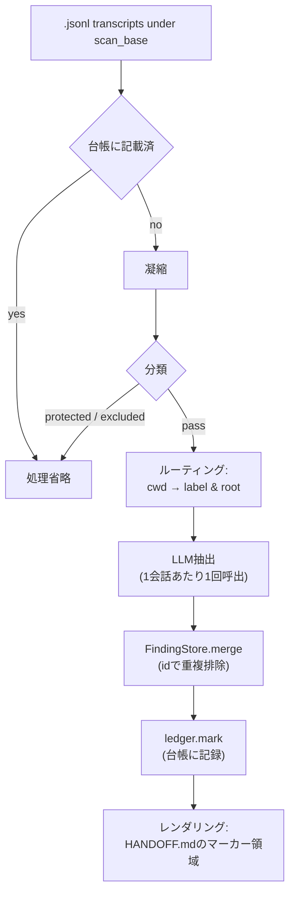

**日本語** | [English](README.en.md)


# claude-transcript-organizer

> Claude Code の会話 transcript を解析し、プロジェクトごとの `HANDOFF.md` に知見を蓄積する CLI ツール。LLM は提案するだけで、書き込みは決定論的コードが担うため、API 障害でも HANDOFF は壊れない。
> A CLI that distils Claude Code transcripts into per-project `HANDOFF.md` — the LLM only proposes, deterministic code does every write, so a flaky LLM never corrupts your HANDOFF.
>
> **Version 1.1.0**

`~/.claude/projects` 以下に蓄積された会話ファイル(`.jsonl`)を走査し、**LLM** に投げて技術的知見・決定事項・TODO を抽出。プロジェクトルートの `HANDOFF.md` にある専用マーカー領域へ自動で書き込み、人間が書いたそれ以外の文章はそのまま保持します。



> ドキュメント: 操作手順は [docs/USAGE.md](docs/USAGE.md)、設計・アーキテクチャは [docs/DESIGN.md](docs/DESIGN.md)。

---

## 基本フロー: organize → status → delete

### 1. 整理 (organize)

```bash
python cli.py organize
```

会話を走査し、LLM で知見を抽出して HANDOFF を更新します。書き込みをせずに内容だけ確認したい場合:

```bash
python cli.py organize --dry-run
```

処理の内訳（読込中のトランスクリプト・分類/ルート判定・抽出した findings）を逐次見たい場合は `--verbose`（`-v`）。トレースは **stderr**、最終サマリは **stdout** に出力されます。各行は英語で `HH:MM:SS · event · id · detail` 形式（event = `read`/`route`/`extract`/`skip`/`dry-run`/`handoff`）。TTY では最下行に残数つき進捗バー（`#` ハッシュ）が固定表示されます。

```bash
python cli.py organize --verbose
```

出力例（stderr）:

```
02:29:47 · read    · 04520aae-5f96-48f5-99a8-a112de5b2042 · title='Review feature design' cwd=… msgs=23 chars=7119
02:29:47 · route   · 04520aae-5f96-48f5-99a8-a112de5b2042 · label=my-project root=<PROJECTS>/my-project
02:29:52 · extract · 04520aae-5f96-48f5-99a8-a112de5b2042 · proposed=7 {'decision': 3, 'next_step': 2, 'gotcha': 2} new=4
02:30:01 · skip    · 0c059f90-dc2f-4ab3-84d3-5b5f24a059ce · trivial (too little content)
02:35:10 · handoff · my-project · <PROJECTS>/my-project/docs/HANDOFF.md
[##############----------]  58.3%  712/1220  remaining 508
```

特定プロジェクトだけ対象にする場合:

```bash
python cli.py organize --project my-project
```

台帳登録済みの会話も再処理する場合（HANDOFF再構築用）:

```bash
python cli.py organize --rebuild
```

整理が終わると、続けて削除（trash 退避）するか確認します。`y` で `delete --yes` 相当を実行し、それ以外なら何も削除しません。確認を省いて自動で退避まで進めるには `--yes`（`-y`）を付けます。`--dry-run` のときは確認しません。

```bash
python cli.py organize -y        # 整理後そのまま削除まで実行
```

### 2. 状態確認 (status)

```bash
python cli.py status
```

未処理件数・台帳登録件数・findings 件数をプロジェクト別に表示します。

### 3. 削除 (delete)

```bash
# dry-run: 削除候補を表示するだけ（デフォルト）
python cli.py delete

# 実際にtrashへ退避する
python cli.py delete --yes

# 特定プロジェクトだけ対象にする場合
python cli.py delete --project my-project --yes
```

trash へ退避した会話は、台帳からも同時に取り除きます。実体のない孤児エントリが台帳に溜まらず、`status` の台帳件数も実状に合います。

### 4. 再描画 (render)

中断やプロセス kill で「findings は保存済みだが HANDOFF が未更新」のまま残ったときに、保存済み findings から HANDOFF を **LLM なしで**作り直します（`--rebuild` の再抽出と違い課金は伴いません）。

```bash
python cli.py render                       # 全ラベルの HANDOFF を再生成
python cli.py render --project my-project   # 1ラベルだけ
python cli.py render --dry-run              # 対象を確認するだけ
```

出力先はラベルから逆算します。`organize` と同じ設定（`PROJECTS` ルート）で実行してください。ルートのディレクトリが無いラベルは `missing_root` でスキップし、削除済みプロジェクトを作り直しません。

---

## インストール

Python 3.9+ があれば動きます。標準ライブラリのみで、追加パッケージは不要です。リポジトリを任意の場所に clone し、`cli.py` のある直下で各コマンドを実行します。

```bash
git clone <repo> claude-transcript-organizer
cd claude-transcript-organizer
python cli.py status        # 動作確認（読み取りのみ）
```

`tsorg`/`tstat`/`tsdel`/`tsren` をどのディレクトリからでも呼べるようにするには、`bin/` を PATH に通します。OS ごとの実行の仕組みやローカル LLM の構成例は[短縮コマンド](#短縮コマンド-tsorg--tstat--tsdel--tsren)を参照してください。

### Windows

同梱の `install.ps1` を一度実行すると `bin/` をユーザー PATH に追加します。冪等なので、再実行しても重複しません。

```powershell
.\install.ps1
```

実行中のシェルにも PATH を反映するため、その場で `tsorg` を呼べます。新しいシェルでも有効です。スクリプト実行がポリシーで止まる場合は `powershell -ExecutionPolicy Bypass -File install.ps1` で起動します。外すときは `-Uninstall` を付けます。

```powershell
.\install.ps1 -Uninstall
```

手動で追加する場合は次の通り（PowerShell）。

```powershell
$bin = "<このリポジトリ>\bin"
$cur = [Environment]::GetEnvironmentVariable("Path", "User")
if (($cur -split ';') -notcontains $bin) {
  [Environment]::SetEnvironmentVariable("Path", $cur.TrimEnd(';') + ';' + $bin, "User")
}
```

各 `.cmd` はリポジトリ位置を `%~dp0` で自動解決するため、リポジトリを移動しても PATH を貼り直すだけで動きます。日本語出力の文字化け回避のため `chcp 65001`（終了時に元へ復元）を、Windows 実行時は併せて `PYTHONUTF8=1` を設定しています。

### macOS / Linux

`install.sh` を実行すると、posix 版ラッパーに実行権限を付け、`~/.local/bin` にシンボリックリンクを張ります。冪等です。

```bash
sh install.sh
```

リンク先を変えるなら `TSORG_BIN_DIR=/usr/local/bin sh install.sh`。リンク先が PATH に無ければその旨を表示します。外すときは `sh install.sh --uninstall`。PATH に `bin/` を直接通しても構いません。

```bash
export PATH="$PATH:/path/to/repo/bin"   # シェルの rc に書く
```

各ラッパーはリポジトリ位置を自前で解決するため、リポジトリを移動してもリンクを張り直すだけで動きます。

---

## プロバイダ選択

`--provider` フラグまたは `config.json` の `provider` キーでバックエンドを切り替えられます。

```bash
python cli.py organize --provider gemini      # デフォルト
python cli.py organize --provider anthropic
python cli.py organize --provider openai
python cli.py organize --provider ollama      # ローカル; APIキー不要
```

各プロバイダが必要とする環境変数:

| プロバイダ | 環境変数 |
|-----------|---------|
| `gemini` | `GEMINI_API_KEY` |
| `anthropic` | `ANTHROPIC_API_KEY` |
| `openai` | `OPENAI_API_KEY` |
| `ollama` | 不要（`config.json` の `endpoint` で接続先を指定） |

---

## 短縮コマンド (tsorg / tstat / tsdel / tsren)

任意のディレクトリから手軽に呼べるよう、`bin/` にラッパーを同梱しています。Windows 用は `.cmd`、macOS/Linux 用は拡張子なしのシェルスクリプト（`tsorg`/`tstat`/`tsdel`/`tsren`）で、同名のため PATH を通せばどの OS でも同じコマンド名で動きます。

| コマンド | 等価 |
|---------|------|
| `tsorg` | `python cli.py organize …` |
| `tstat` | `python cli.py status` |
| `tsdel` | `python cli.py delete` |
| `tsren` | `python cli.py render` |

`tsorg` は `--verbose` を既定で付与します。Windows の `.cmd` 版はリポジトリ直下の設定ファイルの有無で実行先を切り替えます（アダプティブ）。

- **`config.wsl.json` が存在する場合 → WSL 内で実行**（`wsl python3 cli.py …`）。ローカル LLM を WSL 上の ollama で動かす構成向け。Windows⇄WSL 境界越しの HTTP POST は連続実行で不安定なため、ツール自体を WSL 内で動かし**ネイティブ localhost**で ollama を叩きます。
- **無い場合 → Windows の python で実行**し、`config.local.json`（あれば）を読みます。

macOS/Linux の posix 版はこの分岐を持たず、常に `python3` で実行し、`config.local.json` があればそれを、無ければ `config.json` を読みます。

いずれの設定ファイルも `.gitignore` 済みで任意。Windows の `tstat`/`tsdel`/`tsren` は LLM を使わないため常に Windows 側で実行します。

- **`--verbose`** で会話ごとの処理トレース（英語 `HH:MM:SS · event · id · detail` 形式＋最下行の進捗バー）を **stderr** に、最終サマリを **stdout** に出力します。

引数はそのまま転送され、末尾が後勝ちのため、その回だけ別プロバイダへ上書きもできます。

```bat
tsorg                              ← config.(wsl|local).json の provider で実行
tsorg --dry-run
tsorg -y                           ← 整理後に確認なしで削除まで実行
tsorg --provider anthropic         ← その回だけ上書き
tsorg --project my-project
tstat
tsdel
tsdel --yes
tsren                              ← findings から HANDOFF を再描画（LLM 不使用）
```

#### Windows ネイティブで使う場合（`config.local.json`）

WSL を介さず Windows の python で直接動かす構成。`config.wsl.json` を置かなければ `tsorg` はこの経路で実行されます。会話の `cwd` は Windows パスのまま記録されるため、`aliases` は不要です。

クラウドのプロバイダ（既定の Gemini など）を使うなら設定ファイルは要りません。API キーを環境変数に入れて呼ぶだけで動きます。

```powershell
$env:GEMINI_API_KEY = "..."   # 常用するなら setx で永続化
tsorg --dry-run
```

ラベル解決の基準 `roots.PROJECTS` や保存先を自分のマシンに合わせるなら、`config.local.json` に上書きを書きます。Windows ネイティブの ollama を使う場合も、このファイルでエンドポイントとモデルを指定します。パスは Windows 形式で書きます。

```jsonc
{
  "provider": "ollama",
  "providers": {
    "ollama": { "endpoint": "http://localhost:11434", "model": "qwen3.5:4b", "think": false }
  },
  "scan_base": "~/.claude/projects",
  "roots": { "PROJECTS": "D:\\path\\to\\projects" },
  "archive_root": "D:\\path\\to\\projects\\_conversation-archive"
}
```

前提: Windows 側に python 3.9+ があること。ollama を使うなら Windows 版 ollama を入れ、`ollama serve` を起動して対象モデルを `ollama pull` しておく。クラウドのプロバイダを使うなら ollama は不要です。

#### WSL 上の ollama を使う場合（`config.wsl.json`）

WSL（例: AlmaLinux）の ollama をローカル LLM として使う構成例。パスは **WSL 視点(posix)** で書き、Windows パスで記録された会話 `cwd` は `aliases` で `/mnt/...` に読み替えます。`think:false` は思考モデル（gemma/qwen3 等）の冗長な thinking 出力を抑止します（抽出には不要・高速化）。

```jsonc
{
  "provider": "ollama",
  "providers": {
    "ollama": { "endpoint": "http://127.0.0.1:11434", "model": "gemma4:12b", "think": false }
  },
  "scan_base": "/mnt/c/Users/<user>/.claude/projects",
  "roots": { "PROJECTS": "/mnt/d/path/to/projects" },
  "archive_root": "/mnt/d/path/to/projects/_conversation-archive",
  "aliases": [ ["D:\\path\\to\\projects", "/mnt/d/path/to/projects"] ]
}
```

前提: WSL 側に `python3`（3.9+ で可。`from __future__ import annotations` 済み）と ollama・対象モデルがあること。`data_dir` は未指定ならリポジトリ直下 `data/` に解決され、Windows 実行（`tstat`/`tsdel`）と台帳を共有します。

#### macOS / Linux で使う場合（`config.local.json`）

posix 版のラッパーは `python3` で直接実行します。パスはすべて posix 形式で書き、`scan_base` は実環境に合わせます。会話 `cwd` も posix パスで記録されるため `aliases` は不要です。

クラウドのプロバイダを使うなら、API キーを環境変数に入れるだけで設定ファイルは要りません。

```bash
export GEMINI_API_KEY="..."   # 常用するならシェルの rc に書く
tsorg --dry-run
```

ローカル LLM を使うなら、native ollama を入れて `ollama serve` を起動し、対象モデルを `ollama pull` します。エンドポイントは `http://localhost:11434` をそのまま指定します。

```jsonc
{
  "provider": "ollama",
  "providers": {
    "ollama": { "endpoint": "http://localhost:11434", "model": "qwen3.5:4b", "think": false }
  },
  "scan_base": "~/.claude/projects",
  "roots": { "PROJECTS": "/Users/<user>/projects" },
  "archive_root": "/Users/<user>/projects/_conversation-archive"
}
```

`scan_base` の `~` はホーム展開されます。Linux なら `roots`/`archive_root` を `/home/<user>/...` に置き換えます。前提は `python3` 3.9+ と、ローカル LLM を使う場合の ollama・対象モデルだけです。

| OS | ollama の入れ方 | 接続先 |
|----|----------------|--------|
| macOS | 公式アプリ、または `brew install ollama` で入れて `ollama serve` | `http://localhost:11434` |
| Linux | `curl -fsSL https://ollama.com/install.sh \| sh` で入れて `ollama serve` | `http://localhost:11434` |
| WSL | ディストリ内に ollama を入れて `ollama serve`（本ツールも WSL 内で実行） | `http://127.0.0.1:11434`（WSL 内 localhost） |

別マシンの ollama に繋ぐ場合は `endpoint` をそのホストの `http://<host>:11434` に変えます。リモート側は `OLLAMA_HOST=0.0.0.0` で待ち受ける設定が必要です。

---

## HANDOFF マーカー領域の動作

HANDOFF.md に以下のマーカーブロックを含めると、`organize` 実行時にブロック内の内容だけが自動生成コンテンツで置き換えられます。

```markdown
<!-- BEGIN transcript-organizer -->
（ここが自動生成領域）
<!-- END transcript-organizer -->
```

**マーカー外の文章は一切書き換えません。** プロジェクトの説明・手順・メモはマーカーの外に書いておけば永続します。マーカーが存在しない場合はファイル末尾に追記されます。

---

## delete の安全モデル

| 特性 | 説明 |
|------|------|
| **dry-run デフォルト** | `--yes` なしでは何も削除しない。候補件数を表示するだけ |
| **台帳ゲート** | `organize` 済みで台帳に記録された会話のみが削除候補になる |
| **最近のセッション保護** | `protect_recent_minutes`（デフォルト 30 分）以内に更新されたファイルは削除対象から除外 |
| **protect_session_ids** | config に列挙したセッション ID は常に保護 |
| **trash 退避** | 即時削除ではなく `data/trash/` へ移動。`delete.trash_retention_days`（デフォルト 14 日）後に GC |
| **台帳の同期** | trash 退避した会話は台帳からも除く。孤児エントリが溜まらない |

`organize`（`tsorg`）は整理後に削除するか確認し、`-y` で確認を省けます。詳しくは[整理 (organize)](#1-整理-organize)を参照してください。

---

## 設定 (config.json)

`config.json` が既定値。主なキー:

| キー | 既定 | 説明 |
|------|------|------|
| `provider` | `gemini` | 使用する LLM プロバイダ |
| `scan_base` | `~/.claude/projects` | 会話ファイルのスキャン起点 |
| `archive_root` | `~/File/projects/_conversation-archive` | アーカイブ済み会話の置き場 |
| `include_sidechain` | `false` | サイドチェーン会話を含めるか |
| `condense_cap` | `22000` | LLM に渡す前の最大文字数 |
| `protect_recent_minutes` | `30` | この時間以内の会話は削除保護 |
| `delete.trash_retention_days` | `14` | trash の保持日数 |

---

## テスト

```bash
python -m pytest -q
```

---

## ライセンス

MIT
