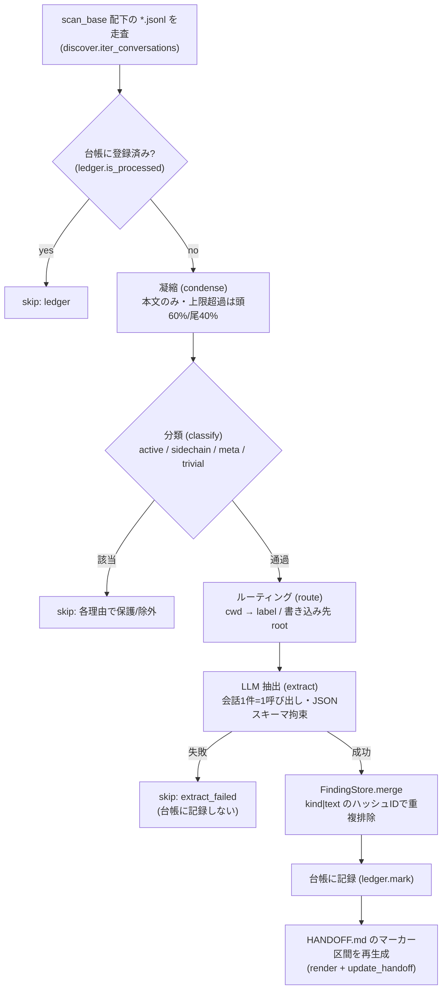

# 設計ドキュメント (DESIGN)

claude-transcript-organizer のアーキテクチャと設計判断をまとめる。README より踏み込み、各モジュールの責務・データ形式・不変条件・拡張点まで記述する。今後の改修や機能追加の際は、まずこの文書で全体像と前提を確認してほしい。操作手順は [USAGE.md](USAGE.md) を参照。

## 設計思想

中心にあるのは **「LLM は提案、コードが統合」** という分担である。LLM は各会話から findings（構造化された事実）を提案するだけで、台帳・findings ストア・HANDOFF への書き込みはすべて決定論的な Python が担う。LLM が失敗しても、不正な JSON を返しても、API が落ちても、台帳や HANDOFF が壊れることはない。失敗した会話はその回だけスキップされ、台帳に記録されないため次回また処理対象に戻る。

この分担から、次の性質が導かれる。

- **追加依存なし。** 標準ライブラリだけで動く。HTTP も `urllib` を直接使う。Python 3.9 以上で動作する（`from __future__ import annotations` により新しい型注釈構文を旧バージョンでも解釈できる）。
- **差分処理。** 会話は台帳で一度だけ処理する。再実行は増えた分だけを抽出する。
- **人間の記述は不可侵。** HANDOFF.md の自動生成はマーカー区間の内部に限定し、区間外は一切触れない。
- **冪等な統合。** 同じ findings を何度マージしても、ID 重複排除により内容は増えない。出典とタイムスタンプだけが累積する。

## 全体構成

```
cli.py                       エントリポイント（argparse・verbose トレーサ）
transcript_organizer/
  models.py                  ConvMeta / Condensed / Target / Finding の dataclass
  config.py                  既定値 + config.json の読込（load_config）
  discover.py                jsonl 走査・メタ抽出・分類（iter_conversations / scan_meta / classify）
  condense.py                jsonl → 本文のみの凝縮テキスト
  route.py                   会話の cwd → ラベルと書き込み先 root
  extract.py                 凝縮文 → findings 提案（プロンプト・スキーマ・検証・再試行）
  findings.py                findings の永続化・ID 重複排除・出典累積（FindingStore）
  ledger.py                  処理済みセッション台帳・原子的書き込み
  render.py                  findings → HANDOFF マーカー区間の生成・差し替え
  deleter.py                 処理済み会話の trash 退避・保持期間 GC
  pipeline.py                organize / status を束ねる中核
  providers/                 LLM バックエンド（base / gemini / anthropic / openai / ollama / _http）
```

| モジュール | 主な公開 API |
|---|---|
| `config.py` | `load_config(path) -> Config` |
| `discover.py` | `iter_conversations(config)` / `scan_meta(path) -> ConvMeta` / `classify(meta, body, config, now_epoch) -> set` |
| `condense.py` | `condense(path, cap=22000) -> Condensed` |
| `route.py` | `route(cwd, config) -> Target` |
| `extract.py` | `extract(condensed, provider, label, retries=2) -> list[Finding]` / `FINDINGS_SCHEMA` / `VALID_KINDS` |
| `findings.py` | `FindingStore(data_dir).load/merge` / `normalize_id(kind, text) -> str` |
| `ledger.py` | `Ledger(path).is_processed/mark/drop/all` / `atomic_write_json(path, obj)` |
| `render.py` | `render_markdown(records, label, date) -> str` / `update_handoff(root, block) -> str` |
| `deleter.py` | `plan_deletion(config, now_epoch, only_label) -> dict` / `execute(plan, config, yes) -> dict` / `gc_trash(config, now_epoch) -> int` |
| `pipeline.py` | `organize(config, provider, ...) -> dict` / `status(config) -> dict` / `current_protect(config) -> set` |
| `providers/__init__.py` | `get_provider(config) -> Provider` |

## 処理フロー



### organize の手順

`pipeline.organize` は次の順で1会話ずつ処理する。スキップ判定はこの順序で、最初に該当した理由で打ち切る。

1. 台帳・FindingStore・保護セッション集合を初期化する。
2. `iter_conversations` で会話メタの一覧を得る。総数を確定し、進捗コールバックに渡す。
3. 各会話について
   1. セッション ID が保護集合にあれば `protected` でスキップ。
   2. `--rebuild` でなく台帳に登録済みなら `ledger` でスキップ。
   3. `condense` で本文を凝縮し、`read` トレースを出す。
   4. `classify` の結果を見て `active` → `sidechain`（`include_sidechain` が偽のとき）→ `meta` → `trivial` の順にスキップ判定。
   5. `route` で書き込み先を決め、`route` トレースを出す。
   6. `--project` 指定があり一致しなければ `other_label` でスキップ。
   7. `--dry-run` なら抽出せず、`touched` に記録して次へ（処理数にはカウントする）。
   8. `extract` を呼ぶ。`ExtractionError` なら `extract_failed` でスキップ（台帳には記録しない）。
   9. `store.merge` で findings を統合し、新規件数を得る。`extract` トレースを出す。
   10. `ledger.mark` で台帳に記録し、`touched[label] = root` を更新する。
4. dry-run でなければ、`touched` の各ラベルについて findings を読み直し、`render_markdown` でブロックを作り、`update_handoff` で HANDOFF を更新する。
5. `{"processed", "skipped", "added", "handoffs"}` を返す。

CLI（`cli.py`）の `organize` は、dry-run でなければ整理の後に削除するか確認する。`y` または `--yes`（`-y`）なら `plan_deletion` → `execute(yes=True)` → `gc_trash` を続けて呼ぶ。非対話（EOF）や否定回答なら削除しない。

### status の手順

`pipeline.status` は書き込みをしない。`iter_conversations` を回して台帳に無い会話を数え（未処理件数）、台帳エントリ数を数え、`data/findings/*.json` をラベルごとに読んで件数を集計する。戻り値は `{"unprocessed", "ledger", "labels"}`。未処理件数には保護対象（active 等）も含まれるため、実際に organize される数とは一致しないことがある。

### delete の手順

`deleter.plan_deletion` が削除候補と保護内訳を決め、`execute` が実体を trash へ移動し、`gc_trash` が古い退避を掃除する。`execute` は trash へ移したファイルの sid を `ledger.drop` で台帳からも除き、台帳を実在する会話と同期させる（孤児エントリを残さない）。詳細は後述の「削除の安全モデル」を参照。

## データモデルと永続フォーマット

### dataclass（models.py）

```python
ConvMeta(path, sid, cwd, first_ts, last_ts, nmsg, is_sidechain, basename)
Condensed(title, cwd, first_ts, last_ts, nmsg, body)
Target(label, root)
Finding(kind, text, confidence, source, src_ts, label)
```

`ConvMeta.sid` は jsonl ファイル名から拡張子 `.jsonl` を除いた文字列。`ConvMeta.nmsg` は走査時に数えた user/assistant 行の総数で、分類のしきい値判定に使う。`Condensed.nmsg` は凝縮で実際に本文化されたメッセージ数で、両者は一致しない。`Condensed.cwd` は会話中に最も多く現れた cwd（`scan_meta` の `cwd` は最初に現れたもの）であり、ルーティングには `Condensed.cwd` を使う。

### 台帳 `data/ledger.json`

セッション ID をキーに持つ単一の JSON オブジェクト。値は処理時のメタ情報。

```json
{
  "0c059f90-dc2f-4ab3-84d3-5b5f24a059ce": {
    "label": "Webs__portfolio",
    "convid": "0c059f90-dc2f-4ab3-84d3-5b5f24a059ce",
    "src_ts": "2026-06-25T06:35:53.428Z",
    "processed_at": "2026-06-25"
  }
}
```

`is_processed` の真偽が差分処理の核。抽出が成功して初めて `mark` され、原子的に書き戻される。抽出失敗時は書かれないため、再実行で再び対象になる。会話を trash へ退避すると `drop` でエントリを取り除き、台帳を実在する会話と同期させる（孤児エントリを残さない）。

### findings `data/findings/<label>.json`

ラベルごとの findings レコードの配列。

```json
[
  {
    "id": "d93dae9d5a5e9d75",
    "kind": "decision",
    "text": "抽出された日本語の事実（1-2文）",
    "confidence": 0.9,
    "src_titles": ["会話タイトルA", "会話タイトルB"],
    "src_ts_list": ["2026-06-20T00:00:00Z", "2026-06-25T00:00:00Z"],
    "first_seen": "2026-06-20T00:00:00Z",
    "last_seen": "2026-06-25T00:00:00Z"
  }
]
```

`id` は `normalize_id(kind, text)` で決まる16桁。`src_titles`・`src_ts_list` は同一 finding を再観測するたびに重複なく追記され、`confidence` は最大値、`last_seen` は最新の `src_ts` に更新される。

すべての JSON は `atomic_write_json` で書く。一時ファイルへ書いて `os.replace` で置換するため、書き込み中に落ちても既存ファイルは壊れない（`indent=1`・`ensure_ascii=False`）。

### trash `data/trash/<YYYY-MM-DD>/...`

`delete --yes` で退避した会話を、`scan_base` からの相対パスを保ったまま日付ディレクトリ下に移動する。物理削除はしない。`trash_retention_days` を過ぎた日付ディレクトリは次回の `delete --yes` 時に `gc_trash` が削除する。

## 走査と分類（discover）

`iter_conversations` は `scan_base/**/*.jsonl` を再帰グロブし、`exclude_globs`（既定 `*autonomous*`）に一致するパスを除外して `ConvMeta` を逐次 yield する。

`scan_meta` は jsonl を1行ずつ読み、最初の `cwd`、最初と最後の `timestamp`、user/assistant 行数を拾う。`isSidechain` フィールドがあるか、ファイル名が `agent-` で始まるか、パスに `/subagents/` を含む場合は `is_sidechain` を立てる。

`classify(meta, body, config, now_epoch)` はスキップ用フラグの集合を返す。

| フラグ | 条件 | 備考 |
|---|---|---|
| `sidechain` | `meta.is_sidechain` | サブエージェントログ |
| `meta` | `meta_signatures` の全要素が body に含まれる | 本ツール自身の出力を弾く |
| `trivial` | `nmsg < min_msgs` かつ `len(body) < min_chars` | 中身が薄い会話 |
| `active` | 直近 `protect_recent_minutes` 分以内に更新 | `last_ts` が無ければファイル mtime を使う |

`pipeline.organize` ではこのフラグに加えて、台帳・保護セッション・`--project` 不一致・抽出失敗を独自に判定する。スキップ理由の全体像は次の通り。

| 理由 | 判定箇所 | 意味 |
|---|---|---|
| `protected` | pipeline | `protect_session_ids` または環境変数 `CLAUDE_SESSION_ID` に一致 |
| `ledger` | pipeline | 台帳に登録済み（`--rebuild` で無視） |
| `active` | classify | 直近活動中で保護 |
| `sidechain` | classify | サブエージェントログ（`include_sidechain` で取り込み可） |
| `meta` | classify | 本ツールの抽出メタ |
| `trivial` | classify | 中身が薄い |
| `other_label` | pipeline | `--project` と異なるラベル |
| `extract_failed` | pipeline | 再試行を使い切って抽出失敗 |
| `excluded` | discover | `exclude_globs` 一致でそもそも走査対象外 |

## 凝縮（condense）

`condense(path, cap)` は jsonl を1メッセージずつ走査し、抽出に効く情報だけを残した本文テキストへ縮約する。

- user/assistant メッセージのみ対象。`content` が文字列なら 2500 文字で切り、`[ROLE] text` として並べる。
- `content` がブロック配列なら、`text` ブロックは 3500 文字で切り、`thinking` ブロックは捨てる。
- `tool_use` は `[tool:NAME] key` に要約する。`key` はツール種別ごとに、Write/Edit/Read は file_path、Bash はコマンド（180 文字）、Grep/Glob は pattern と path、Task/Agent は description か prompt（120 文字）を採る。
- `tool_result` は `is_error` か先頭 200 文字に error/fail/panic/exception/traceback を含むときだけ `[tool_result ERROR] msg` として残す。成功結果は本文に残さない。
- `image` ブロックは `[image]` に置換する。
- ハーネスが注入する `<system-reminder>` や `<local-command>` 等で始まる文字列は `[harness/command injection 省略]` に置き換える。
- `summary` レコードは `[SUMMARY]`（500 文字）として残し、`aiTitle`/`ai-title` レコードからタイトルを採る。

切り詰めの末尾には ` …[+Nc]`（残り文字数）を付ける。全体長が `cap` を超えたら、頭 `int(cap*0.6)` と尾 `cap - 頭` を残し、間に `…[中略 Nc]…` を挟む。会話の前半（要件確認）と後半（結論）を残し、中盤の試行錯誤を落とす狙い。

## ルーティング（route）

`route(cwd, config)` は会話に記録された `cwd` を `roots.PROJECTS` と照合し、`Target(label, root)` を返す。照合は `/` 区切りに正規化して行い、返す `root` は `os.path.join` で実行 OS ネイティブの区切りに組み立てる。

1. `cwd` が空なら `_archive`（`archive_root`）。
2. `aliases` を順に見て、`cwd` がいずれかの旧 prefix に一致または配下なら新 prefix に読み替える。最初に一致したものだけ適用する。
3. 読み替え後の `cwd` が `PROJECTS` 自身、または `PROJECTS/` 配下なら相対パスを取り、先頭要素 `comp` を決める。
   - `comp` が `containers` に属し、第2要素があれば、ラベル `comp__sub`、root は `PROJECTS/comp/sub`。
   - そうでなければラベル `comp`、root は `PROJECTS/comp`。
   - その root がディレクトリとして存在すれば `Target` を返す。存在しなければ `_archive`。
4. いずれにも当たらなければ `_archive`。

`PROJECTS` 直下そのもの（相対要素が空）や、移動済みでディレクトリが消えた cwd は `_archive` に集約される。aliases は Windows パスで記録された `cwd` を WSL の `/mnt/...` へ読み替える用途を想定している。

## 抽出（extract）

`extract(condensed, provider, label, retries)` は凝縮文をプロンプトに組み、`provider.propose_findings(prompt, FINDINGS_SCHEMA)` を最大 `retries + 1` 回試す。

`VALID_KINDS` は `design_requirement` / `decision` / `completed` / `in_progress` / `next_step` / `gotcha` / `open_question` の7種。`FINDINGS_SCHEMA` は `findings` 配列を要求し、各要素に `kind`（enum）・`text`・`confidence` を必須とする JSON Schema。

応答の各要素は、`kind` が `VALID_KINDS` に属し `text` が非空のものだけ採用し、`Finding` に変換する。`source` には会話タイトル、`src_ts` には `last_ts` を入れる。1回でも成功すれば findings を返し、全試行が例外で終われば `ExtractionError` を投げる。再試行に待機やバックオフは入れない。プロンプトは「既存の設計書に載りにくい会話固有の事実だけを、kind のいずれかとして日本語1-2文で返す」よう指示する。

## findings の統合（findings）

`normalize_id(kind, text)` は text の空白を1個に畳み、小文字化し、`、。,.\-_/:：；;　` を除いたうえで `kind|正規化text` の SHA1 先頭16桁を返す。表記ゆれを吸収して同一事実を1レコードに束ねるための鍵。

`FindingStore.merge(label, findings)` は既存レコードを ID で引き、

- 既存なら `src_titles`・`src_ts_list` に重複なく追記し、`last_seen` と `confidence`（最大値）を更新する。
- 新規ならレコードを作り、新規件数を1増やす。

戻り値は新規追加された ID の数。重複は件数に含めない。これにより、同じ会話を `--rebuild` で再処理しても findings が水増しされない。

## レンダリング（render）

`render_markdown(records, label, date)` は findings を kind で束ね、固定順のセクションに並べる。

| kind | 見出し |
|---|---|
| `design_requirement` | ### 設計・要件 |
| `decision` | ### 設計判断と理由 |
| `completed` | ### 完成・動作中 |
| `in_progress` | ### 未完・途中 |
| `next_step` | ### 次にやること |
| `gotcha` | ### 注意点・ハマりどころ |
| `open_question` | ### 未決事項 |

`completed` と `in_progress` だけは `last_seen` の降順に並べ替える。状態系は新しい情報を上に出すため。各行は `- {text}（出典: {src_titles の先頭2件}）`。本文と出典からは `BEGIN`/`END` マーカー文字列を除去し、LLM 生成文がマーカーを注入できないようにする。ブロックは `<!-- BEGIN transcript-organizer -->` で始まり `<!-- END transcript-organizer -->` で終わり、先頭に `## 自動抽出（transcript-organizer 管理 / <date> 更新）` を置く。

`update_handoff(root, block)` は `root/docs/HANDOFF.md` を対象に、ファイルにマーカー区間があればその内部だけを差し替え、無ければ末尾に追記する。ファイルが無ければ `# HANDOFF（引き継ぎメモ）` を見出しに新規作成する。区間外の文章には一切触れない。

## プロバイダ

すべてのプロバイダは `Provider.propose_findings(text, schema) -> dict` だけを実装する。HTTP は `providers/_http.post_json` に集約し、`urllib` で POST して JSON を返す。URL スキームは http/https のみ許可し、タイムアウトは60秒。`get_provider(config)` が `config.provider` で実装を遅延 import して返す。`mock` はテスト用で、固定 findings を返すか失敗を模す。

| プロバイダ | エンドポイント | 構造化出力の方式 | API キー |
|---|---|---|---|
| `gemini` | `v1beta/models/<model>:generateContent` | `generationConfig.response_schema` | `x-goog-api-key`。未設定ならリクエスト前に明示エラー |
| `anthropic` | `v1/messages` | `tools`＋`tool_choice` で `emit` を強制し `tool_use.input` を採る | `x-api-key`。キー未設定でも送信はする |
| `openai` | `v1/chat/completions` | `response_format: json_object` | `Authorization: Bearer`。未設定ならリクエスト前に明示エラー |
| `ollama` | `<endpoint>/api/chat` | `format: "json"` | 不要 |

`gemini` と `openai` は呼び出し前に環境変数を確認し、未設定なら誤送信せず即停止する。`anthropic` は空キーのまま送るため、未設定時は API 側の認証エラーが再試行を経て `extract_failed` になる。`ollama` は `conf` に `think` があれば payload に乗せ、思考モデル（gemma/qwen3 等）の冗長な thinking 出力を抑止する。API キーは `config.json` に書かず、`providers.<name>.api_key_env` が指す環境変数で渡す。

## 設定（config）

`load_config(path)` は `_DEFAULTS` を deep copy し、`path` の JSON が存在すれば既定に存在するキーだけ上書きする（未知キーは無視）。`data_dir` が未指定ならリポジトリ直下の `data/` に解決する。`scan_base`・`archive_root`・`data_dir` と `roots` の各値・`aliases` の各ペアは `~` を展開する。

| キー | 既定 | 意味 |
|---|---|---|
| `provider` | `gemini` | 既定 LLM プロバイダ |
| `providers` | 4種の定義 | プロバイダごとの `api_key_env`・`model`、ollama は `endpoint`・任意で `think` |
| `scan_base` | `~/.claude/projects` | 会話 jsonl の走査ルート |
| `roots.PROJECTS` | `~/File/projects` | プロジェクト群のルート（ラベル解決の基準） |
| `archive_root` | `~/File/projects/_conversation-archive` | 解決不能な会話の集約先 |
| `containers` | `[Other, School, Webs, claude, discord-bots, mcp, Exam]` | `comp__sub` ラベルにする中間ディレクトリ |
| `aliases` | `[]` | `cwd` の prefix 読み替え `[["旧", "新"]]` |
| `exclude_globs` | `["*autonomous*"]` | 走査から除外するパス |
| `include_sidechain` | `false` | true でサブエージェントログも抽出対象に |
| `meta_signatures` | `["引き継ぎ", "transcript-organizer"]` | 全要素が本文にあれば `meta` で除外 |
| `protect_recent_minutes` | `30` | 直近活動を保護する分数 |
| `condense_cap` | `22000` | 凝縮本文の上限。超過で頭60%/尾40%に分割 |
| `min_msgs` / `min_chars` | `2` / `400` | これ未満は `trivial` |
| `retries` | `2` | 抽出の再試行回数（合計 `retries+1` 回） |
| `delete.trash_retention_days` | `14` | trash の保持日数 |
| `protect_session_ids` | `[]` | 常に保護するセッション ID |
| `data_dir` | `null` | 台帳・findings・trash の置き場。null でリポジトリ直下 `data/` |

`--config` で別ファイルを指定できる。`config.local.json`（Windows ネイティブ向け）と `config.wsl.json`（WSL 向け）はラッパーが状況で渡す任意のローカル設定で、いずれも `.gitignore` 済み。`data_dir` を既定のままにすれば、実行環境が違っても同じ台帳を共有する。

## 削除の安全モデル（deleter）

`plan_deletion` は会話を1件ずつ見て、最初に該当した保護理由で候補から外す。順序は次の通り。

1. `session_id`（保護セッション）
2. `unprocessed`（台帳に無い＝未処理）
3. `sidechain`（サブエージェントログ）
4. `active`（直近活動中。`classify` で再判定）
5. `other_label`（`--project` 指定時、ラベル不一致）

ここを通過したものだけが削除候補になる。台帳に記録された＝抽出済みの会話しか消えないことが、findings を取り損ねない保証になる。

`execute` は `yes=False` なら何も動かさず候補数だけ返す。`yes=True` のときは候補を `data/trash/<日付>/` へ `shutil.move` し、移したファイルの sid を `ledger.drop` で台帳からも除く。移動前に各パスが `scan_base` 配下にあることを実パスで再確認し、範囲外はスキップする。`gc_trash` は `trash_retention_days` を過ぎた日付ディレクトリを mtime 基準で削除する。

## 不変条件と拡張点

### 守るべき不変条件

- **LLM は書かない。** 永続化は `FindingStore.merge`・`ledger.mark`・`update_handoff` を通すコードだけが行う。
- **台帳は抽出成功後にのみ進む。** 失敗時に `mark` してはならない。再処理性が壊れる。
- **JSON は原子的に書く。** 直接 `open(..., "w")` で台帳/findings を書かない。`atomic_write_json` を使う。
- **HANDOFF はマーカー区間だけ。** `update_handoff` の差し替えロジックを迂回しない。
- **重複排除は ID 基準、累積は出典基準。** 件数の増加は新規 ID のときだけ。

### 拡張の勘所

- **プロバイダを足す。** `providers/<name>.py` に `Provider` 実装を置き、`propose_findings` で `{"findings": [...]}` を返す。`config.py` の `providers` に既定を追加し、`get_provider` に分岐を1つ加える。HTTP は `_http.post_json` を使う。
- **finding の種別を足す。** `extract.VALID_KINDS` に kind を追加し、`render._SECTIONS` に `(kind, 見出し)` を1行足し、`build_prompt` の説明を更新する。台帳・ストア・重複排除は kind を文字列として扱うので変更不要。
- **スキップ条件を足す。** `classify` にフラグを足し、`pipeline.organize` に判定とトレース・`bump` を加える。新フラグは戻り値の `skipped` に自然に現れる。
- **設定キーを足す。** `_DEFAULTS` に既定を、`Config` dataclass にフィールドを足す。パス系なら `_PATH_KEYS` に加えて `~` 展開の対象にする。`load_config` は `Config` のフィールドだけを拾うので、余分なキーは自動的に落ちる。

## テストと前提

`python -m pytest -q` で全テストが通る。ネットワークは不要で、LLM 呼び出しは `MockProvider` で差し替える。前提は Python 3.9 以上と標準ライブラリのみ。ローカル LLM を使う場合だけ ollama と対象モデルが要る。
